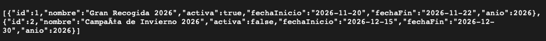
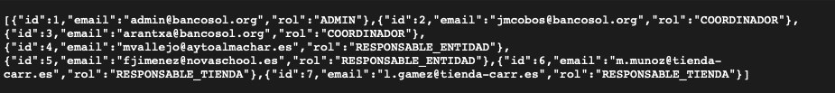
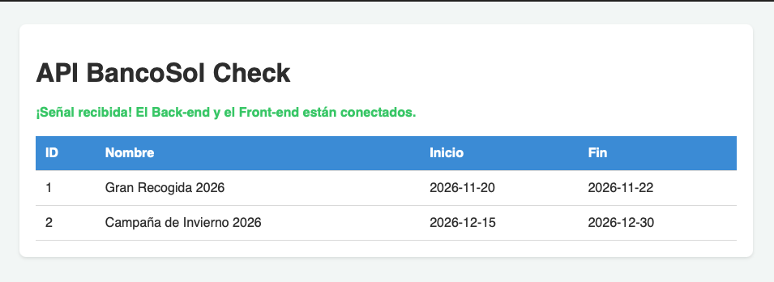
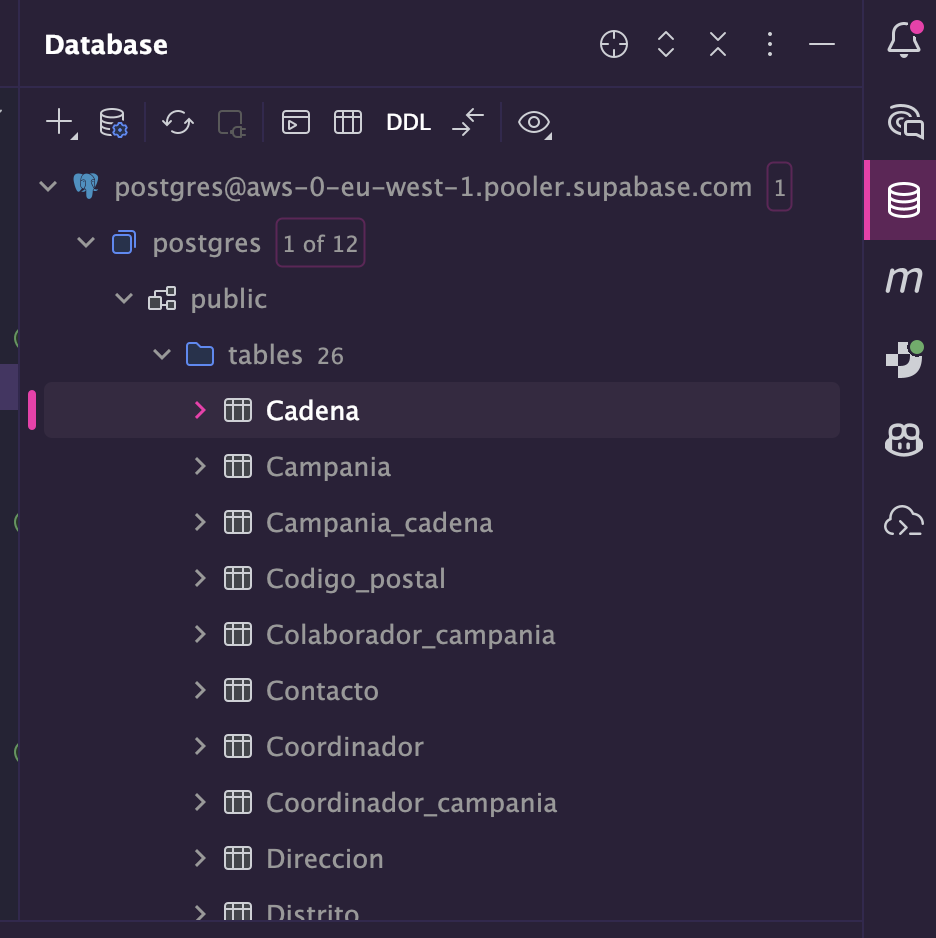
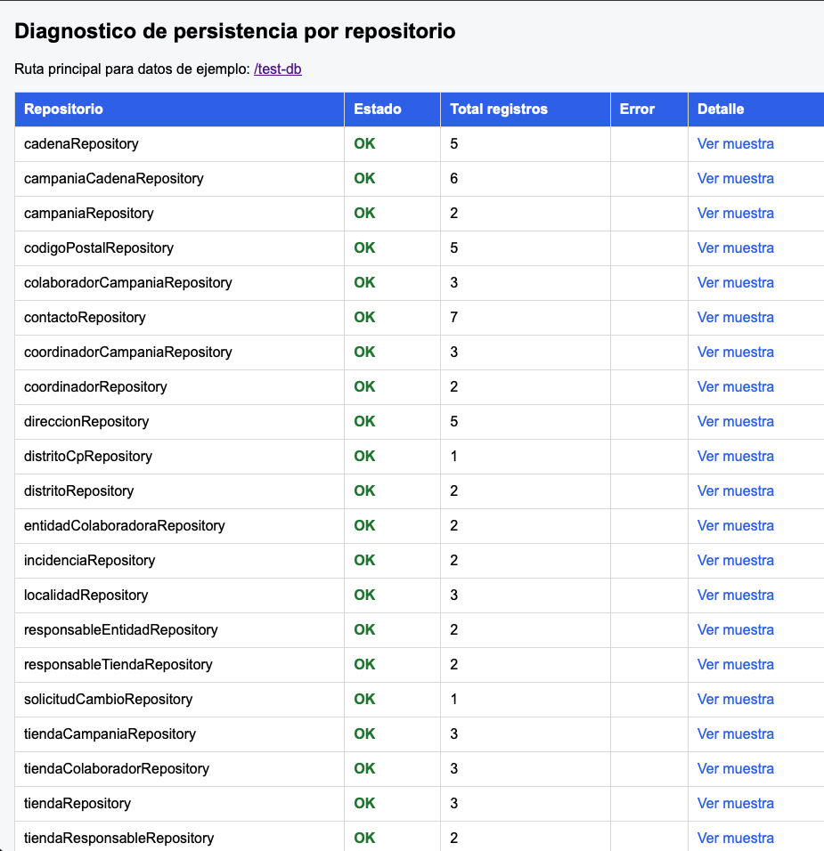

# Cómo conectar Springboot al Front-End

## Antes de nada

Debéis tener la persistencia de la BBDD realizada en SpringBoot. Como consejo, **os recomiendo** que:

1. Conectéis la BBDD al proyecto
2. Creéis esta [jerarquía](#jerarquía-de-carpetas)
3. Aseguraros de que la BBDD está [bien conectada](#buena-conexión-a-la-bbdd)
4. Generad la persistencia de la BBDD
5. Realizar algún test para comprobar la persistencia. Aquí tenéis [un ejemplo](#ejemplo-de-comprobación-de-persistencia)

Dicho esto, en el flujo de trabajo utilizaremos un **Patrón DTO Unificado**: `@Entity` se queda guardada en la BBDD y **solo trabajaremos con el DTO.**

**Todo el material os lo debeis descargar de la carpeta `/resources`.**

> La conclusión es que **solo tenemos que escribir y modificar sobre** `services` (restricciones, funciones y lógica de las entidades), `/controllers` (gestión de recursos para jsp)

## Paso a paso para crear la API

### Paso 1 - Añadir todos los DTO

En el directorio `/dto`, añadiremos las clases DTO que os he dejado en la carpeta dto.

Un `dto` es una versión simplificada de la entidad. Será con lo que trabajemos en los controladores (tanto de API como de JSP).

*Recordad: los DTOs son nuestro filtro de privacidad. Si una entidad tiene contraseña, el DTO nunca la lleva. Es como exportar un archivo de audio: mandamos el sonido, pero no los metadatos privados del autor.*

### Paso 2 - Añadir todos los services

> Los services que se proporcionan tienen la lógica básica para devolver el objeto en DTO. Si queréis añadirle funcionalidades adicionales (gestión de contraseñas, restricciones, etc.), deberéis hacerlo vosotros independientemente.

En el directorio `/services`, añadiremos las clases Service que os he dejado en la carpeta services.

Los services son los **únicos que tienen permiso para comunicarse con `Repository`**

Reciben una entidad del DAO, le aplica la lógica de negocio y lo transforma en un DTO.

**Siempre devuelven un DTO** o una lista de ellos.

> Importante: La lógica de los DTOs no debéis tocarla. El objeto que devuelve es el que debe devolver. Podeis agregar lógica que no modifiquen al DTO.

### Paso 3 - Añadir los RestController

En la carpeta `/api`, agregad los RestController que os dejaré en la carpeta api.

### Paso 4 - Configuración del CORS

Debeis añadir el archivo `webConfig.java`.

Este paso es necesario para poder hacer fetch desde liveServer:

```Java
package com.bancosol.config;

import org.springframework.context.annotation.Configuration;
import org.springframework.web.servlet.config.annotation.CorsRegistry;
import org.springframework.web.servlet.config.annotation.WebMvcConfigurer;

@Configuration
public class WebConfig implements WebMvcConfigurer {

    @Override
    public void addCorsMappings(CorsRegistry registry) {
        registry.addMapping("/api/**") // Aplicamos a todos los endpoints de la API
                .allowedOrigins("http://127.0.0.1:5500", "http://localhost:5500") // El puerto de tu Live Server
                .allowedMethods("GET", "POST", "PUT", "DELETE")
                .allowedHeaders("*");
    }
}
```

### Paso 5 - Comprobar que todo ha ido bien

**Debes tener la aplicación en SpringBoot ejecutándose siempre**

#### Prueba inicial

Primero probaremos directamente desde la URL, poniendo por ejemplo:

`http://localhost:8080/api/campanias`
`http://localhost:8080/api/usuarios`

Nos deben devolver estos resultados:





#### Prueba final

Descargaros la carpeta de prueba que os he pasado: `/prueba` y ejecutadla con LiveServer. Debería verse así:




## Entender los flujos

Es recomendable saber cómo funciona cada Servicio u Objeto para un uso adecuado de él.

Además, deberíais mirar cómo está pensada la lógica en el código para que sepais manejarlo bien.

Por otro lado, la BBDD nunca falla. Desde Supabase resolveréis todas las dudas (están ahí las claves, los IDs únicos, los campos nullable, las dependencias, las restricciones...)

### Front-End

1. El controlador (de la API) llama a Service y recibe el objeto en forma de DTO

2. Cuando devuelve el objeto, lo devuelve en JSON.

### Back-End (SSR)

1. El controlador (de controllers) llama a Service, recibe el DTO y lo introduce en Model.

2. En el `.jsp`, se accede a los datos normalmente con `${objeto.atributo}`.


## Anexo

### Jerarquía de carpetas

```
src/main
|_ /java
    |_ /com/bancosol/
        |_ /api            --> Aquí meteremos los controladores para la api (RestControllers)
        |_ /controllers    --> Controladores para JSP exclusivamente
        |_ /entities       --> Entidades generadas con persistencia
        |_ /services       --> Cada servicio es toda la lógica de una Entidad
        |_ /dao            --> Repositorios
        |_ /dto            --> Objetos que viajan al Front
        |_ /config
            |_ WebConfig.java --> Para que funcionen los fetchs desde JS (pensado para Live Server)
|_ resources
|_ webapp
```

### Buena conexión a la BBDD



### Ejemplo de comprobación de persistencia

Esta lógica obviamente la teneis que montar vosotros, si hacéis esto no os va a salir nada claramente, pero es un ejemplo de cómo he probado yo mi persistencia

Me direcciono a `http://localhost:8080/test-db/diagnostico` y me sale esto:

